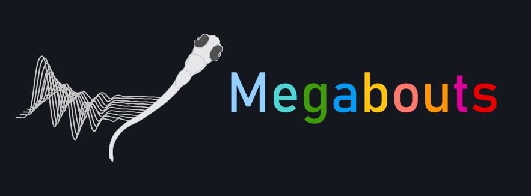

# Megabouts 🐟

<div align="center">



[](https://badge.fury.io/py/megabouts)
[](https://megabouts.ai)

</div>

## Overview

Megabouts is a Python toolbox designed to precisely quantify zebrafish larval locomotion. Our software supports locomotion analysis in both freely swimming and head-restrained conditions, adapting to various experimental setups and recording speeds.

**📚 Full documentation and tutorials available at: [megabouts.ai](https://megabouts.ai)**

## Features

- **Flexible Data Input**:
  - Multiple tracking methods (full tracking, head tracking, tail tracking)
  - Support various frame rates (20-700 Hz) and resolutions
  - Compatible with different tracking software (e.g., SLEAP)

- **Analysis Pipeline**:
  - Tail angle and trajectory preprocessing
  - Tail bout detection
  - Movement classification using transformer neural networks
  - Sparse coding for head-restrained experiments

## Installation

```bash
pip install megabouts
```

## Quick Start

```python
from megabouts.tracking_data import TrackingConfig, FullTrackingData, load_example_data
from megabouts.pipeline import FullTrackingPipeline

# Load example data
df_recording, fps, mm_per_unit = load_example_data("fulltracking_posture")

# Configure tracking
tracking_cfg = TrackingConfig(fps=fps, tracking="full_tracking")

# Create tracking data
head_x = df_recording["head_x"].values * mm_per_unit
head_y = df_recording["head_y"].values * mm_per_unit
head_yaw = df_recording["head_angle"].values
tail_angle = df_recording.filter(like="tail_angle").values

tracking_data = FullTrackingData.from_posture(
    head_x=head_x, 
    head_y=head_y, 
    head_yaw=head_yaw, 
    tail_angle=tail_angle
)

# Create pipeline and run
pipeline = FullTrackingPipeline(tracking_cfg)
tracking, tail, traj, segments, bouts, ethogram = pipeline.run(tracking_data)
```

## License

This software is available for non-commercial research and academic use only. The software was developed by Adrien Jouary, Ph.D. in the laboratory of Michael B. Orger at Fundação Champalimaud. For full license terms, please see the [LICENSE.md](LICENSE.md) file.

## Citation
```bibtex
@article{jouary2024megabouts,
    title={Megabouts: a flexible pipeline for zebrafish locomotion analysis},
    author={Jouary, Adrien and Laborde, Alexandre and Silva, Pedro T and Mata, J Miguel 
            and Marques, Joao C and Collins, Elena and Peterson, Randall T 
            and Machens, Christian K and Orger, Michael B},
    journal={bioRxiv},
    pages={2024--09},
    year={2024},
    publisher={Cold Spring Harbor Laboratory}
}
```

## Contact

- **Author**: Adrien Jouary
- **Email**: adrien.jouary at research.fchampalimaud.org
- **Organization**: Champalimaud Foundation

## Acknowledgments

This work was developed at the Champalimaud Foundation in the laboratory of Michael B. Orger.

