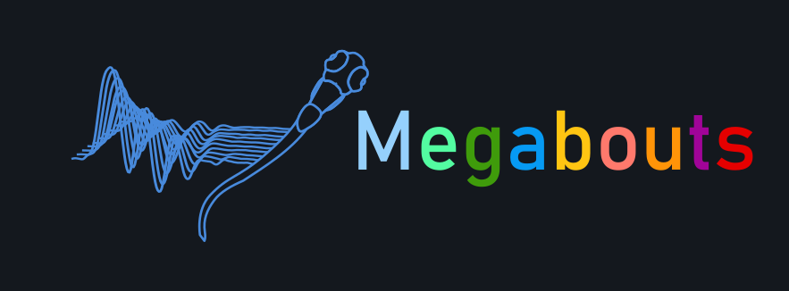
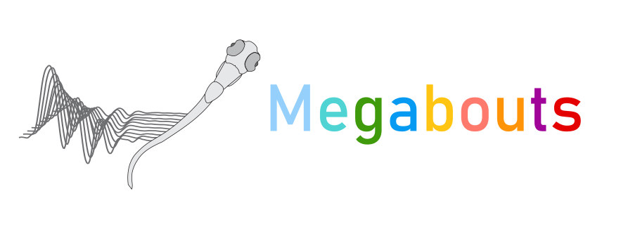

.. rst-class:: heading-center

Welcome to Megabouts' documentation!
====================================

Accurate measurements of behavior are crucial to understanding animal physiology. 
Megabouts allows to quantify zebrafish larvae locomotion. 
This open-source Python toolbox handles locomotion in both freely swimming and head-restrained conditions and aims to promote standardized zebrafish locomotion analysis across neuroscience, pharmacology, and genetics.

The details for the underlying mathematics can be found in
`our paper on ArXiv <https://arxiv.org>`_:

Jouary, A et al., *Megabouts: a toolbox for quantifying zebrafish locomotion*, ArXiv e-prints number, 2024

You can find the software `on github <https://github.com/>`_.

.. raw:: 
    :file: figure_2.html

**Installation**

PyPI install, presuming you have pytorch and all its requirements installed:

.. code:: bash

    pip install megabouts

.. toctree::
   :hidden:

   Home <self>

.. note::
    :class: dropdown

    This is my note.

.. toctree::
   :maxdepth: 1
   :caption: User Guide / Tutorial:

   notebooks/Loading_Data
   notebooks/test
   api/index
